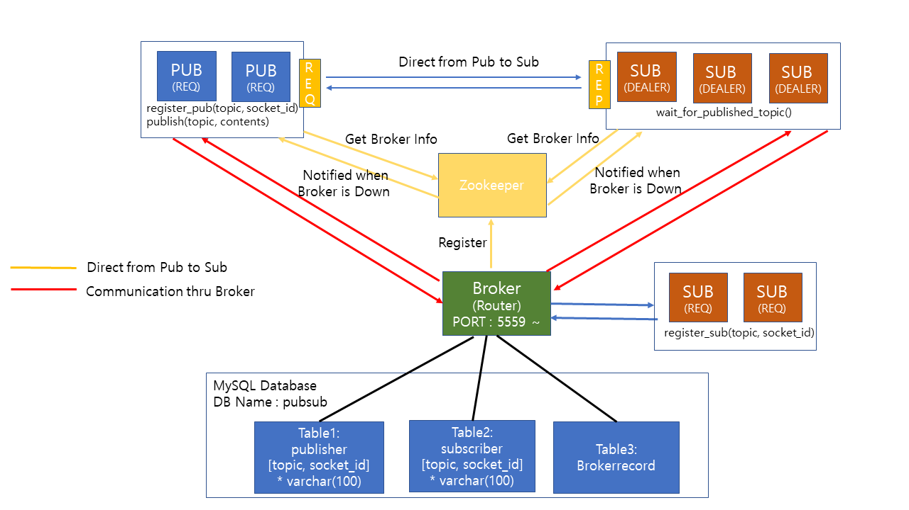
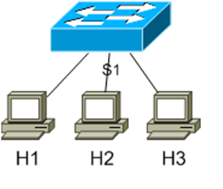

**Vanderbilt University**

**2020 Distributed Systems Principles(CS6381) Assignment2 : Pub/Sub Model Implementation using ZeroMQ+Zookeeper**

## System Diagram

## How to Execute
**0. Prerequirement**
 - Mysql Database
  - user information : ID - 'lhh@localhost', PW - '1234'
  - Database Name : pubsub
  - Table Information
     1. publisher
        -- create table publisher(topic varchar(100), socket_id varchar(100));
        
     2. subscriber
        -- create table subscriber(topic varchar(100), socket_id varchar(100));
  
     3. brokerrecord
        -- create table brokerrecord(publisher_port varchar(10), broker_address varchar(100), topic varchar(100), contents varchar(1000), start_time timestamp, elapsed_time FLOAT(20,10));

**1. Zookeeper tasks**
 Start Zookeeper
 - $ zkServer.sh start
 Connect to Zookeeper
 - $ zkCli.sh
 delete 'broker' node if exists
 - [zk: localhost:2181(CONNECTED) 0] deleteall /broker
 
 
**2. Publisher to Subscribers using Broker **
* broker's IP address and Port number are required
 Execute the Broker
 - $ python3 broker.py broker0 5559
     - broker0 : zookeeper node name
     - 5559 : port number of this broker
 Execute the Subscriber
 - $ python3 sub.py I
     - I : Indirect communication (Using Broker)
 Execute the Publisher
 - $ python3 pub.py I Y
     - I : Indirect communication (Using Broker)
     - Y : Automatic execution (if 'N': you can put in the topic and contents yourself)

**3. Directly from Publisher to Subscribers **
 Execute the Broker
 - $ python3 broker.py broker0 5559
     - broker0 : zookeeper node name
     - 5559 : port number of this broker
 Execute the Subscriber
 - $ python3 sub.py D
     - D : Direct communication between subscriber and publisher
 Execute the Publisher
 - $ python3 pub.py D Y
     - D : Direct communication between subscriber and publisher
     - Y : Automatic execution (if 'N': you can put in the topic and contents yourself)
 
 
 ## Testing Environment
  - Minimal 3 client Topology
  
